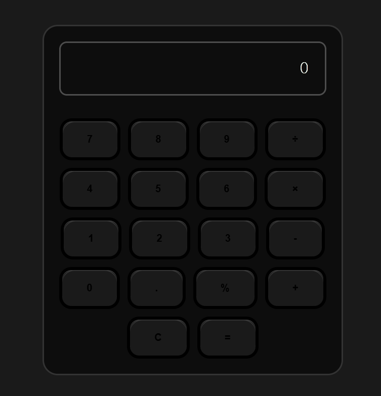

# GlowCalc

**Modern calculator with interactive glow effects that follow your cursor**  
*Built with vanilla JavaScript and CSS*

 

## Credits
- Amir-Ranjbr/[glowyTextButton](https://github.com/Amir-Ranjbr/glowyTextButton)

